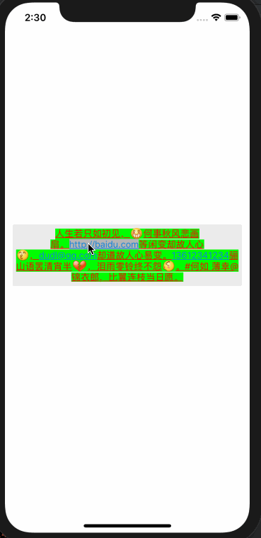

# SWExLabel

[](https://travis-ci.org/wyx96553@163.com/SWExLabel)
[](https://cocoapods.org/pods/SWExLabel)
[](https://cocoapods.org/pods/SWExLabel)
[](https://cocoapods.org/pods/SWExLabel)

## Example

To run the example project, clone the repo, and run `pod install` from the Example directory first.

## Requirements

## Installation

SWExLabel is available through [CocoaPods](https://cocoapods.org). To install
it, simply add the following line to your Podfile:

```ruby
pod 'SWExLabel'
```

## Author

wyx96553@163.com, wyx96553@163.com

## License

SWExLabel is available under the MIT license. See the LICENSE file for more info.

##  补充说明
本项目参考了Objective-C 的MLLabel， 地址： https://github.com/molon/MLLabel。
感谢该作者。

## 示例： 


## 使用示例：

ALLabel : 只能展示表情，无法点击邮箱、电话、链接

ALLinkLabel: 既能展示表情，又能点击邮箱


```Swift

lazy var label: ALLinkLabel = {
    let label = ALLinkLabel.init(frame: CGRect.zero)
    label.backgroundColor = UIColor.init(white: 0.920, alpha: 1.000)
    return label
}()

label.textColor = UIColor.red
label.font = UIFont.systemFont(ofSize: 14)
label.numberOfLines = 0
label.textAlignment = .center
label.textInsets = UIEdgeInsets.init(top: 5, left: 5, bottom: 5, right: 5)
label.allowLineBreakInsideLinks = false

let exp = ALExpression.init(regex: "\\[[a-zA-Z0-9\\u4e00-\\u9fa5]+\\]", plistName: "Expression", bundleName: "ClippedExpression")
let attr = "人生若只如初见，[坏笑]何事秋风悲画扇。http://baidu.com等闲变却故人心[亲亲]，dudl@qq.com却道故人心易变。13612341234骊山语罢清宵半[心碎]，泪雨零铃终不怨[左哼哼]。#何如 薄幸@锦衣郎，比翼连枝当日愿。".expressionAttributedString(expression: exp)
let m_attr = NSMutableAttributedString.init(attributedString: attr)
m_attr.addAttribute(NSAttributedString.Key.backgroundColor, value: UIColor.green, range: NSMakeRange(0, m_attr.length))
m_attr.addAttribute(NSAttributedString.Key.underlineStyle, value: NSUnderlineStyle.styleSingle.rawValue, range: NSMakeRange(0, m_attr.length))
label.attributedText = m_attr
label.setDidClickLink { (link, text, label) in
let alert = UIAlertController.init(title: "点击了", message: "link: \(link.linkType), text: \(text)", preferredStyle: UIAlertController.Style.alert)
let action = UIAlertAction.init(title: "取消", style: UIAlertAction.Style.cancel, handler: { (action) in
alert.dismiss(animated: true, completion: nil)
})
alert.addAction(action)
self.present(alert, animated: true, completion: nil)
}
```
